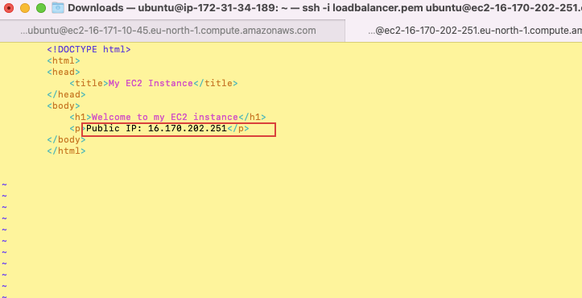

# LOADBALANCER

## SETTING UP A BASIC LOADBALANCE

#### Two instances that will be created, each with Apache web server installed. The necessary ports will be opened in each instance to allow traffic from anywhere. These instances will be updated to display their IP addresses. Additionally, an extra instance will be created with NGINX installed and configured to act as a load balancer, distributing traffic across the web servers. The steps below outline how this is achieved:

#### Step - 1 Create two instances.

The image below shows Instance 1 created and named `APACHECLB1`

The seconcd instance is created and shown below; `APACHELB2`

 

#### Step - 2 Add Port 8000

For the 2 intances, open port 8000 by editing the inbound rules for both, as shown in the images below

 

 

#### Step - 3 Connect the instances

Now that all the instances are set up, they will be connected from the local terminal through `SSH` as shown in the images below. it should be noted that the key should be made viewable before connection is attempted.
Here, the key pair is '`loadruner.pem' and the DNS will be used in the command instead of the IP address

The images below show how the connection for both instances are made.

  

  

  

 

#### Step - 4 Install Apache

Once connected, apache is installed on both instances as below.

 

 

 

 

#### Step - 5 configure Apache

Now that the apache is installed for each instance, the apache webserver will be configured to serve content on port 8000. This will involve creating a new index.html to display the IP address of the instance. The steps are shown below for both instances. 

Both need to be configured to listen from port 8000

 

 

 

 

As shown below, the default configuration must also be changed such that thier vitualhost port 80 is 8000

 

 

 

 

Once the above is completed, restart apache 

 

 

As mentioned ealier, index.html files are to be created. This will also be edited as shown below

 

 

 

 

The file ownership should also be changed for the index.html files

 

 

The default html file should be overidden as shown below.

once the overide is completed, restart apache2

 

#### Step - 6 Update and dispplay IP address

By typing the IP address of both instances in the browser. the following is displayed in each case

 

 

#### Step - 7 Launch additional Intance

A new instance called `NGINXLB` is created. This will act as the loadbalancer. 

 

Ensure port 80 is accepting traffic from anywhere

 

Connect into instance as shown below using SSH. 

 

#### Step - 8 Install NGNIX

Once connection is completed, update and install NGINX, and verify that it is active

 

 

#### Step - 9 Configure NGINX

 

Edit the configuration file to ensure NGINX is acting as a load balancer by editing the backend servers to the IP addresses of the apache webservers and the IP address of the NGINX as the server

 

Test the configuration and restart NGINX
 

#### Step - 10 Display IP address

Paste the IP address of the NGINX and the should display the same pages being served by the webservers

 
